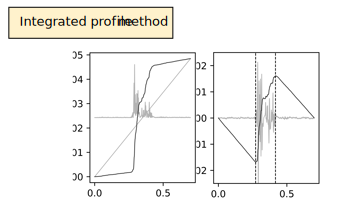

Automatic detection of EMG busts
================================

Myonset integrates several tools for the processing of electromyographic data signals.
Those tools should be used in combination of our visualization tool, allowing easy visualization and manual correction of EMG onset and offset markers (see :ref:`viz module guide <guide_vizEMG>`). 

Myonset contains signal processing functions, methods for automatic detection, and two algorithms combining different automatic detection methods, intended to result in 
optimized automatic detection. Both algorithms consist in a two-steps method: first step is to individualize EMG burst(s) present in the signal,
while second step is to determine the latency at which each EMG burst starts (onset) and ends (offset). The first step is based on a threshold method, different between
the two algorithms (custom single threshold in `get_onsets` function, and double threshold in `get_onsets_dbl_th`), while the second step is always performed using the
‘integrated profile’ method. All those methods and their combination are described in details below.

1. Methods overview
-------------------

Numerous methods have been proposed to determine EMG bursts onset and offset, but none has been shown to be as good as human visual detection.
Accordingly, our intention here is not to provide a perfect automatized detection, but rather to improve automatic detection as much as possible,
and make the unavoidable manual correction step as easy as possible (see :ref:`viz module guide <guide_vizEMG>` for manual correction).
DEBut automatic detection is based on different methods previously proposed for EMG signal processing. :ref:`Figure 1 <figure1>` illustrates the application of those different methods
on a raw EMG signal (shown on :ref:`Figure 1 <figure1>`, top left). As can be seen, each approach presents different benefits and drawbacks:

* The frequently-used variance threshold methods, illustrated on top right panel of :ref:`Figure 1 <figure1>`, detect EMG activity when signal amplitude exceeds some threshold value computed from the EMG signal mean and variance (see for instance Hodges and Bui, 1996 [HoBu96]_). This method accurately detects periods of active EMG, but tends to over-estimate EMG onset and under-estimate EMG offset.
* The ‘integrated profile’ method (Santello and McDonagh, 1998 [SaMc98]_) provides an accurate detection of burst onset and offset in most cases, but can be used only when one EMG burst has occurred (not less, not more). This method is shown in :ref:`Figure 1 <figure1>`, bottom right panel.  
* The Teager-Kaiser energy operator (TKEO) transformation of EMG signal (Li et al., 2007 [LiZh07]_), shown on bottom left panel of :ref:`Figure 1 <figure1>`, is particularly efficient to amplify EMG burst signal and improve signal-to-noise ratio in the presence of continuous EMG activity, but often erases small EMG bursts (e.g., partial errors). This method does not itself determine activity onset and offset, but can be applied before threshold or integrated profile methods (Solnik et al., 2010 [SRSD10]_; Tenan et al., 2017 [TeTH17]_).

.. _figure1:

.. figure:: ./figures/figure1.svg

    Raw EMG signal (top left) on which three methods of automatic detection are applied: Threshold method (top right), applied on rectified EMG signal ; 
    Teager-Kaiser operator transformation (bottom left) ; and integrated profile method (bottom right).

For optimal automatic detection, we therefore recommend a two-steps approach consisting in: 

1. Individualize the different EMG bursts periods using a threshold method applied on both raw and Teager-Kaiser transformed EMG,  

2. Determine the onset and offset of each burst using the integrated profile method. 

Myonset functions `get_onsets` and `get_onsets_dbl_th` implement such two-steps methods. The two functions differ in the threshold method used for the first step of burst individualisation, 
the former using a single threshold while the latter uses a double threshold method.
Below, we present the Teager-Kaiser EMG transformation, then describe in details the two threshold detection methods to use on both raw and Teager-Kaiser EMG. 
Finally, we present the final step of onset and offset detection based on the integrated profile method. Reader in a hurry may skip the detailed description and go straight
to the :ref:`recommended methods combination <recommended_methods_combination>` section.

2. Detailed methods
-------------------

2.1.  Teager-Kaiser transformation
^^^^^^^^^^^^^^^^^^^^^^^^^^^^^^^^^^

Teager-Kaiser EMG signal conditioning is defined as:

.. math::

    \psi[x(n)] = x^2(n) - x(n+1)x(n-1)

:ref:`Figure 1 <figure1>` shows an example of Teager-Kaiser EMG transformation. As stated above, this method does not detect EMG activity onset and offset but can be applied to 
improve signal-to-noise ratio before detection (e.g., using a threshold method). Comparing raw EMG signal (:ref:`Figure 1 <figure1>`, top left) to Teager-Kaiser EMG (bottom left) 
shows how active EMG signal is amplified over non-active periods. However, even though such transformation can be profitable to reduce EMG noise, it will also erase small EMG 
activities potentially informative (e.g., partial errors). This is visible for instance on :ref:`Figure 1 <figure1>` where small bursts occurring around 0.8-1s are no longer 
visible on Teager-Kaiser signal. In standard conditions, we therefore recommend using detection methods on both raw and Teager-Kaiser signals.

Below is some example code to apply Teager-Kaiser transformation in Myonset, with data a 1D array containing continuous EMG signal::

    import myonset as myo
    tk_emg = myo.tkeo(data)

.. _threshold_detection_methods:

2.2. Theshold detection methods
^^^^^^^^^^^^^^^^^^^^^^^^^^^^^^^

As said above, those methods detect the presence of EMG activity as soon as signal amplitude exceeds a threshold value determined by the mean and variance of baseline EMG signal 
(see for instance Hodges and Bui, 1996 [HoBu96]_). In the case of double threshold method, EMG activity is detected if a minimum number of data points during a given time 
window exceeds the threshold value (see Bonato et al., 1998 [BoDK98]_). We first describe the function ``detector_var``, based on a customized single threshold method, 
and then ``detector_dbl_th`` that uses double threshold detection.

.. _function_detector_var:

2.2.1. Function detector_var

This function detects active EMG time periods on continuous EMG signal, it can be used on raw or Teager-Kaiser transformed EMG. 
For example, with data_trial a 1D array containing single trial EMG signal and times the corresponding time latencies::

    active_periods = myo.detector_var(data_trial, times, th=3.5, sf=sf)

First, the intervals during which rectified EMG amplitude exceeds ``mbsl + (th * stbsl)`` are detected, with ``mbsl`` the mean and ``stbsl`` the variance of rectified EMG signal, 
and ``th`` the specified **threshold** parameter (set to 3.5 by default). :ref:`Figure 2 <figure2>` (upper row) shows the detected active periods when ``th`` value is set to 
3, 6, or 9. Either global or local EMG mean and variance can be used. If not specified, ``mbsl`` and ``stbsl`` are computed on data_trial as the mean and variance of 
rectified signal between first and time 0 samples. To use other values such as global ``mbsl`` and ``stbsl``, specify ``mbsl`` and ``stbsl`` when the function is called::

    active_periods = myo.detector_var(data_trial, times, th=3.5, sf=sf, mbsl=global_mean, stbsl=global_variance)
	
Due to the oscillatory nature of EMG signal, signal amplitude falls below threshold also during active EMG periods. 
To determine the whole time period of muscle activity, consecutive intervals closed in time are merged. The time delay under which intervals are merged is defined by 
``time_limit`` whose default value is set to 0.025s (:ref:`Figure 2 <figure2>`, middle row shows the effect of varying the value of ``time_limit``). 
Finally, in order to reduce the probability that noisy EMG results in false detection of active EMG period, intervals containing only a few data points above threshold are excluded. 
The minimum number of samples is set by ``min_samples`` parameter, default value is 3. The ``varying_min`` parameter allows to automatically increase the minimum number of samples 
required in noisy trials. First, the frequency of *small* EMG bursts in data_trial is computed (small burst is defined as an active period containing less than twice 
the minimum number of samples required). The ``min_samples`` parameter is then increased by the frequency of small bursts multiplied by the ``varying_min`` parameter 
(i.e., the higher the ``varying_min``, the more ``min_samples`` increases in noisy trials). Default ``varying_min`` is 1, set to 0 to avoid adjustment of ``min_samples``. 
The effect of using ``varying_min`` is illustrated in :ref:`Figure 2 <figure2>` (lower row). ::

    active_periods = myo.detector_var(data_trial, times, th=3.5, sf=sf, 
                                      time_limit=.025, min_samples=3, varying_min=1)
	
.. _figure2:

    Function ``detector_var``, effects of varying threshold value (``th``, upper row), the minimum time period separating consecutive bursts (``time_limit``, middle row), 
    and allowing variation of the minimal number of data samples above threshold to define an active EMG period (``varying_min``, lower row). 

.. _function_detector_dbl_th:

2.2.2. Function detector_dbl_th

This function detects the presence of EMG activity when a minimum number of data points exceeds the threshold value in a given time window. 
The threshold is also defined by ``mbsl + (th * stbsl)``, with ``mbsl`` the mean and ``stbsl`` the variance of rectified EMG signal, and ``th`` the threshold parameter. 
In this case however, EMG activity is detected if a sufficient number of ahead data points exceeds the threshold value. 
The number of considered ahead data points is set by the ``window_size`` parameter, whose default value is 0.020s (i.e., 40 ahead points for 2048Hz sampling frequency). 
The required amount of data points above threshold depends of the ``min_above_threshold`` parameter, set to 0.5 by default, meaning that at least half of the data points 
must exceed threshold amplitude. Once active EMG periods have been individualized, periods with less than the minimum required number of samples above threshold are discarded 
(although it happens less frequently than with single threshold method, some transient EMG noise can still result in false detection of active EMG with double threshold detection). 
By default, ``min_samples`` is set to 3. ::

    active_periods = myo.detector_dbl_th(data_trial, times, th=3, sf=sf, 
                                         window_size=.020, min_above_threshold=.5, min_samples=3)
	
:ref:`Figure 3 <figure3>` (left panel) shows detected active periods for default ``window_size`` and ``min_above_threshold`` values. As shown on middle and right panels, 
decreasing parameters values increase detection sensitivity, with a different effect depending on which parameter varies. 

.. _figure3:

.. figure:: ./figures/figure3.svg

    Function ``detector_dbl_th``, and the effect of varying ``window_size`` (middle panel) and ``min_above_threshold`` (right panel).
	
	
2.3. Determination of onset and offset with integrated profile
^^^^^^^^^^^^^^^^^^^^^^^^^^^^^^^^^^^^^^^^^^^^^^^^^^^^^^^^^^^^^^

Utilization of integrated profile to determine EMG activity onset and offset was proposed by Santello and McDonagh (1998 [SaMc98]_; see also Liu and Liu, 2016 [LiLi16]_). 
In this method, EMG onset and offset correspond to the minimum and maximum of EMG signal integrated profile, defined as the difference between the empirical cumulative sum signal 
and its uniform equivalent (i.e., straight-line). The method is illustrated in :ref:`Figure 4 <figure4>`. 
As can be seen, integrated profile provides a straightforward method to accurately determine activity onset and offset. 
The major drawback of this method is that only one onset and one offset can be determined for a given signal, as, by definition, only one minimum and one maximum exist. 

.. _figure4:

    Left panel: raw EMG signal (background grey signal), and corresponding cumulative sum of rectified signal (dark grey), as well as its uniform equivalent 
    (i.e., monotically increasing function, grey straight line) ; Right panel : integrated profile (dark grey) , resulting from the difference between cumulative sum and 
    monotically increasing function. The minimum and maximum values of integrated profile (vertical dotted lines) define raw EMG onset and offset. 

.. _recommended_methods_combination:

3. Recommended methods combination
----------------------------------

For optimal automatic detection of EMG activity onset and offset, we recommend to first individualize EMG burst periods using a threshold method, and second determine 
each EMG onset and offset with integrated profile method. 
:ref:`Figure 5 <figure5>` shows the whole pipeline for such procedure, which has been implemented in Myonset functions ``get_onsets`` and ``get_onsets_dbl_th`` 
(the difference being the threshold method used for first step). In more details, each function consists in:

1. Detect and individualize EMG burst(s) using ``detector_var`` (``get_onsets``) or ``detector_dbl_th`` (``get_onsets_dbl_th``). See :ref:`Threshold detection methods <threshold_detection_methods>` above for more details.
2. Based on 1., split continuous EMG into active and baseline periods (``signal_windows`` function). The initial baseline period is defined from first sample to mean latency between time 0 and first EMG burst, the final baseline period is defined from mean latency between end of last EMG burst and last sample. In between, bounds of active periods are located halfway between consecutive bursts. If EMG activity was detected before time 0 in step 1., first bound is placed halfway between first sample and start of first burst. 
3. For each active EMG period, determine EMG onset and offset using integrated profile. Because this method necessitates both baseline and active EMG signal, detection is performed on a rebuilt signal made of the active period surrounded by the initial and final baseline periods. For best detection even on very small EMG bursts, integrated profile is smoothed by moving average (default size window 0.015s), and minimum and maximum values are detected on a restrained time window around the active EMG period defined in 1. (by default up to -.050s to +.050s around active EMG).  
4. Burst(s) onset and offset are returned in a numpy array, with onsets samples in first column and offset samples in second column. 

.. _figure5:

.. figure:: ./figures/figure5.svg

    Pipeline of ``get_onsets`` and ``get_onsets_dbl_th`` functions: 1. detection of active EMG periods based on ``detector_var`` or ``detector_dbl_th``, 2. split whole signal into 
    active and baseline EMG time windows using ``signal_windows`` function, 3. burst onset and offset in each active EMG period are detected using integrated profile method, 
    and 4. onset and offset are determined as the earliest between integrated profile onset/offset and detector variance method. 

.. _get_onsets:

3.1. Utilization of ``get_onsets`` function
^^^^^^^^^^^^^^^^^^^^^^^^^^^^^^^^^^^^^^^^^^^

For the ``get_onsets`` function, the first step of detection of active EMG windows is based on ``detector_var`` function, which uses a custom single threshold method described 
:ref:`above<function_detector_var>`. 
This first step can be applied either on raw EMG, on Teager-Kaiser EMG, or on both (active EMG is detected if either raw or Teager-Kaiser signal exceeds the threshold). 
Parameters of ``detector_var`` must be set separately for raw EMG and Teager-Kaiser EMG. 
Below is some example code to call the ``get_onsets`` function, and a :ref:`table<table1>` presenting all possible optional parameters::

    onsets,offsets = myo.get_onsets(data_trial, times, sf=sf, 
                                    use_raw=True, th_raw=3.5, varying_min_raw=1,
                                    use_tkeo=True, th_tkeo=8, varying_min_tkeo=0)

.. _table1:

.. table:: Table ``get_onsets`` optional parameters

	+-----------------+--------------------------------------+-----------------+------------+--------------------+
	| Name            | Description                          | Recommended     | Default    | General effect /   |
	|                 |                                      |   value         | value      |     Comment        |
	+=================+======================================+=================+============+====================+
	| use_raw         | If True, apply ``detector_var`` on   | True            | True       | Sensitive to small |
	|                 | raw EMG                              |                 |            | EMG bursts         | 
	+-----------------+--------------------------------------+-----------------+------------+--------------------+
	| th_raw          | Treshold value for raw EMG           |   3 to 7        |   3.5      | Increase to make   |
	|                 |                                      |                 |            | detection less     | 
	|                 |                                      |                 |            | sensitive          | 
	+-----------------+--------------------------------------+-----------------+------------+--------------------+
	|time_limit_raw   | Time delay (in s) under which        | .015 to .035    |   .025     |Decrease to         |
	|                 | consecutive active raw EMG intervals |                 |            |individualize EMG   | 
	|                 | are merged                           |                 |            |bursts close in time| 
	+-----------------+--------------------------------------+-----------------+------------+--------------------+
	|min_samples_raw  | Required minimum number of samples   |   1 to 5        |   3        |Increase to reduce  |
	|                 | above threshold                      |                 |            |detection of small  | 
	|                 |                                      |                 |            |EMG bursts          | 
	+-----------------+--------------------------------------+-----------------+------------+--------------------+
	|varying_min_raw  | The amount by which min_samples is   | 0 (no variation)|   1        |Increase to reduce  |
	|                 | increased if small EMG bursts are    | to 3            |            |detection of small  | 
	|                 | present (active raw EMG periods with |                 |            |EMG burst in noisy  | 
	|                 | less than ``min_samples`` x2 data    |                 |            |trials              |          
	|                 | points above threshold)              |                 |            |                    |
	+-----------------+--------------------------------------+-----------------+------------+--------------------+
	|mbsl_raw         | Mean of rectified raw EMG signal     |Global or trial's| Trial's    |Use trial's mean    |
	|                 |                                      |baseline mean    | baseline   |adapts threshold to | 
	|                 |                                      |                 | mean       |current background  | 
	+-----------------+--------------------------------------+-----------------+------------+--------------------+
	|stbsl_raw        | Variance of rectified raw EMG signal |Global or trial's| Trial's    |Use trial's variance|
	|                 |                                      |baseline variance| baseline   |adapts threshold to | 
	|                 |                                      |                 | variance   |current background  | 
	+-----------------+--------------------------------------+-----------------+------------+--------------------+
	| use_tkeo        | If True, apply ``detector_var`` on   | True            | True       | Less sensitive to  |
	|                 | Teager-Kaiser EMG                    |                 |            | noisy EMG          | 
	+-----------------+--------------------------------------+-----------------+------------+--------------------+
	| th_tkeo         | Treshold value for Teager-Kaiser EMG |   8 to 12       |   8        | Increase to make   |
	|                 |                                      |                 |            | detection less     | 
	|                 |                                      |                 |            | sensitive          | 
	+-----------------+--------------------------------------+-----------------+------------+--------------------+
	|time_limit_tkeo  | Time delay (in s) under which        | .015 to .035    |   .025     |Decrease to         |
	|                 | consecutive active Teager-Kaiser EMG |                 |            |individualize EMG   | 
	|                 | intervals are merged                 |                 |            |bursts close in time| 
	+-----------------+--------------------------------------+-----------------+------------+--------------------+
	|min_samples_tkeo | Required minimum number of samples   |   3 to 15       |   10       |Increase to reduce  |
	|                 | above threshold                      |                 |            |detection of small  | 
	|                 |                                      |                 |            |EMG bursts          | 
	+-----------------+--------------------------------------+-----------------+------------+--------------------+
	|varying_min_tkeo | The amount by which min_samples is   | 0 (no variation)|   0        |Teager-Kaiser       |
	|                 | increased if small EMG bursts are    | to 3            |            |transformation      | 
	|                 | present (active Teager-Kaiser EMG    |                 |            |usually already     | 
	|                 | periods with less than               |                 |            |erases small EMG    |          
	|                 | ``min_samples`` x2 data points above |                 |            |bursts              |
	|                 | threshold)                           |                 |            |                    | 
	+-----------------+--------------------------------------+-----------------+------------+--------------------+
	|mbsl_tkeo        | Mean of rectified Teager-Kaiser EMG  |Global or trial's| Trial's    |Use trial's mean    |
	|                 | signal                               |baseline mean    | baseline   |adapts threshold to | 
	|                 |                                      |                 | mean       |current background  | 
	+-----------------+--------------------------------------+-----------------+------------+--------------------+
	|stbsl_tkeo       | Variance of rectified Teager-Kaiser  |Global or trial's| Trial's    |Use trial's variance|
	|                 | EMG signal                           |baseline variance| baseline   |adapts threshold to | 
	|                 |                                      |                 | variance   |current background  | 
	+-----------------+--------------------------------------+-----------------+------------+--------------------+
	|sf               | EMG signal sampling frequency        |                 |   None     |If not provided, an |
	|                 |                                      |                 |            |error occurs        | 
	+-----------------+--------------------------------------+-----------------+------------+--------------------+
	|ip_search        | Maximum time window (in s) to search | [-.025,.025] to |[-.050,.050]|Affect mainly       |
	|                 | onset and offset around active EMG   | [-.075,.075]    |            |small EMG bursts    | 
	|                 | period                               |                 |            |                    | 
	+-----------------+--------------------------------------+-----------------+------------+--------------------+
	|moving_avg_window| Window width (in s) for moving       | 1/sf (no        |   .015     |Again, affect mainly|
	|                 | average of the integrated profile    | smoothing) to   |            |small EMG bursts    | 
	|                 |                                      | .050            |            |                    | 
	+-----------------+--------------------------------------+-----------------+------------+--------------------+

3.2. Utilization of ``get_onsets_dbl_th`` function
^^^^^^^^^^^^^^^^^^^^^^^^^^^^^^^^^^^^^^^^^^^^^^^^^^

For the ``get_onsets_dbl_th`` function, the first step of detection of active EMG windows is based on ``detector_dbl_th`` function, which uses a double threshold method 
described :ref:`above<function_detector_dbl_th>`. Again, the first detection step can be applied either on raw EMG, on Teager-Kaiser EMG, or on both 
(active EMG is detected if either raw or Teager-Kaiser signal exceeds the double threshold). Parameters of ``detector_dbl_th`` must be set separately for raw EMG and 
Teager-Kaiser EMG. Below is some example code to call the ``get_onsets_dbl_th`` function, and a table presenting all possible optional parameters::

    onsets,offsets = myo.get_onsets_dbl_th(data_trial, times, sf=sf, window_size=.020, min_above_threshold=.5 
                                           use_raw=True, th_raw=3,
                                           use_tkeo=True, th_tkeo=6)

.. _table2:

.. table:: Table ``get_onsets_dbl_th`` optional parameters

	+-------------------+--------------------------------------+-----------------+------------+--------------------+
	| Name              | Description                          | Recommended     | Default    | General effect /   |
	|                   |                                      |   value         | value      |     Comment        |
	+===================+======================================+=================+============+====================+
	| window_size       | Size of the ahead window (in s) in   | .005 to .030    | .020       |Decrease to         |
	|                   | which data points above threshold    |                 |            |individualize EMG   | 
	|                   | are detected                         |                 |            |bursts close in time| 
	+-------------------+--------------------------------------+-----------------+------------+--------------------+
	|min_above_threshold| Minimum amount of data points above  |   .35 to .65    |    .5      | Decrease to be     |
	|                   | threshold in determined window to    |                 |            | more sensitive to  | 
	|                   | detect active EMG                    |                 |            | short EMG bursts   | 
	+-------------------+--------------------------------------+-----------------+------------+--------------------+
	| use_raw           | If True, apply ``detector_dbl_th``   | True            | True       | Sensitive to small |
	|                   | on raw EMG                           |                 |            | EMG bursts         | 
	+-------------------+--------------------------------------+-----------------+------------+--------------------+
	| th_raw            | Treshold value for raw EMG           |   2 to 6        |   3        | Increase to make   |
	|                   |                                      |                 |            | detection less     | 
	|                   |                                      |                 |            | sensitive          | 
	+-------------------+--------------------------------------+-----------------+------------+--------------------+
	|mbsl_raw           | Mean of rectified raw EMG signal     |Global or trial's| Trial's    |Use trial's mean    |
	|                   |                                      |baseline mean    | baseline   |adapts threshold to | 
	|                   |                                      |                 | mean       |current background  | 
	+-------------------+--------------------------------------+-----------------+------------+--------------------+
	|stbsl_raw          | Variance of rectified raw EMG signal |Global or trial's| Trial's    |Use trial's variance|
	|                   |                                      |baseline variance| baseline   |adapts threshold to | 
	|                   |                                      |                 | variance   |current background  | 
	+-------------------+--------------------------------------+-----------------+------------+--------------------+
	| use_tkeo          | If True, apply ``detector_dbl_th``   | True            | True       | Less sensitive to  |
	|                   | on Teager-Kaiser EMG                 |                 |            | noisy EMG          | 
	+-------------------+--------------------------------------+-----------------+------------+--------------------+
	| th_tkeo           | Treshold value for Teager-Kaiser EMG |   8 to 12       |   8        | Increase to make   |
	|                   |                                      |                 |            | detection less     | 
	|                   |                                      |                 |            | sensitive          | 
	+-------------------+--------------------------------------+-----------------+------------+--------------------+
	|mbsl_tkeo          | Mean of rectified Teager-Kaiser EMG  |Global or trial's| Trial's    |Use trial's mean    |
	|                   | signal                               |baseline mean    | baseline   |adapts threshold to | 
	|                   |                                      |                 | mean       |current background  | 
	+-------------------+--------------------------------------+-----------------+------------+--------------------+
	|stbsl_tkeo         | Variance of rectified Teager-Kaiser  |Global or trial's| Trial's    |Use trial's variance|
	|                   | EMG signal                           |baseline variance| baseline   |adapts threshold to | 
	|                   |                                      |                 | variance   |current background  | 
	+-------------------+--------------------------------------+-----------------+------------+--------------------+
	|min_samples        | Required minimal number of samples   |    1 to 5       | 3          |Increase to reduce  |
	|                   | above threshold (for both raw and    |                 |            |detection of small  | 
	|                   | Teager-Kaiser EMG)                   |                 |            |EMG bursts          | 
	+-------------------+--------------------------------------+-----------------+------------+--------------------+
	|sf                 | EMG signal sampling frequency        |                 |   None     |If not provided, an |
	|                   |                                      |                 |            |error occurs        | 
	+-------------------+--------------------------------------+-----------------+------------+--------------------+
	|ip_search          | Maximum time window (in s) to search | [-.025,.025] to |[-.050,.050]|Affect mainly       |
	|                   | onset and offset around active EMG   | [-.075,.075]    |            |small EMG bursts    | 
	|                   | period                               |                 |            |                    | 
	+-------------------+--------------------------------------+-----------------+------------+--------------------+
	|moving_avg_window  | Window width (in s) for moving       | 1/sf (no        |   .015     |Again, affect mainly|
	|                   | average of the integrated profile    | smoothing) to   |            |small EMG bursts    | 
	|                   |                                      | .050            |            |                    | 
	+-------------------+--------------------------------------+-----------------+------------+--------------------+
	

.. rubric :: References

.. [BoDK98] Bonato P, D’Alessio T, Knaflitz M, (1998) A statistical method for the measurementof muscle activation intervals from surface myoelectric signal during gait, IEEETrans Biomed Eng 45:287–299.
.. [HoBu96] Hodges PW, Bui BH (1996) A comparison of computer-based methods for thedetermination of onset of muscle contraction using electromyography, Electromyogr Mot C 101:511–519.
.. [LiZh07] Li X, Zhou P, Aruin AS (2007) Teager–Kaiser energy operation of surface EMG improves muscle activity onset detection. Ann Biomed Eng 35:1532–1538.
.. [LiLi16] Liu J, Liu Q (2016) Use of the integrated profile for voluntary muscle activity detection using EMG signals with spurious background spikes: A study with incomplete spinal cord injury. Biomed Signal Process Control 24:19-24.
.. [SRSD10] Solnik S, Rider P, Steinweg K, DeVita P, Hortobágyi T (2010) Teager-Kaiser energy operator signal conditioning improves EMG onset detection. Eur J Appl Physiol. 110(3):489-98. doi: 10.1007/s00421-010-1521-8.
.. [TeTH17] Tenan MS, Tweedell AJ, Haynes CA (2017) Analysis of statistical and standard algorithms for detecting muscle onset with surface electromyography. PLoS One. 12(5):e0177312. doi: 10.1371/journal.pone.0177312.
.. [SaMc98] Santello M, McDonagh MJN (1998) The control of timing and amplitude of EMG activity in landing movements in humans. Exp Physiol 83:857-874.

