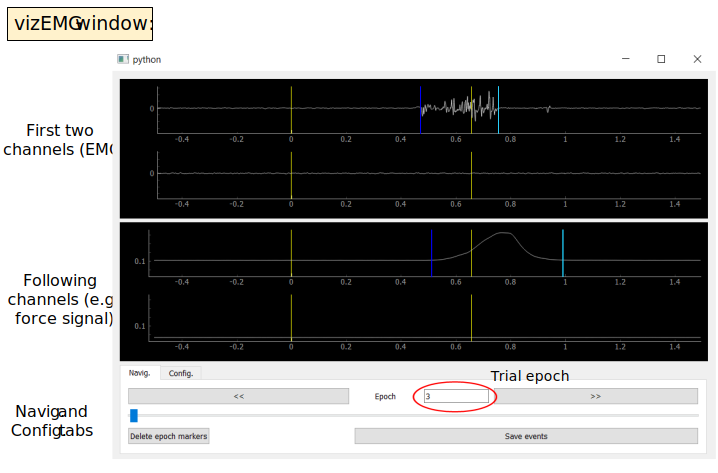

.. _guide_vizEMG:

Onsets and offsets visualization and manual correction  
======================================================

After performing automatic detection, we strongly recommend to proceed to visualization and manual correction of EMG bursts onsets and offsets.
Myonset implements a PyQt application named ``Viz``, especially designed to facilitate this manual step. 
It provides an adapted window view for EMG signals and the associated markers, including experimental triggers and eventual markers resulting from automatic detection 
of EMG onset and offset. Importantly, user can interact with onset and offset markers to:

1. adjust marker(s) position(s)
2. add new onset or offset markers
3. remove existing onset and offset markers

1. Starting Viz window
----------------------
As stated above, viz is only designed for data visualization and manual adjustment of event markers. 
Hence, it usually requires some preliminary steps consisting in:
 
* importing EMG data in a Python environment
* segmenting continuous EMG signal into single trials, usually based on events triggers defining trials' time 0 (``code_t0``)
* performing an automatic detection of EMG onset and offset

Once those steps are achieved, viz can be used::

    import myonset as myo
    import sys
	
    viz = myo.Viz(sys.argv)
    viz.load_data(data, events, code_t0,\
                  code_movable_1='onset', code_movable_2='offset')
    viz.show()

Here, ``data`` is 2D array (channels x time samples), ``events`` is an ``Events`` object (see :ref:`The Events class <the_Events_class>`) containing events markers,
and ``code_t0`` is a list of event codes defining trials' time 0. 
Optional parameters ``code_movable_1`` and ``code_movable_2`` specify the code of the two event markers that could be moved, created or deleted by the user. 

Those commands open the window shown on :ref:`figure below <figure_vizEMG>`. 
Here, the first two channels (channels 0 and 1) contain EMG signal (left and right Abductor Policis Brevis respectively), 
and the two following channels (2 and 3) contain force signal measured by force detectors placed under left and right thumbs. 
This particular trial displays a left-hand response (active EMG and force on the left side). In most cases, force signals are not collected, 
only the EMG signals are displayed in that case.
Note that ``code_movable_1`` and ``code_movable_2`` events are shown in blue (dark and light, respectively), 
and associated with only one channel (channel 0 for EMG onset and offset and channel 2 for force onset and offset).
All other markers (e.g., stimulus and response) are yellow and visible on all channels. 

.. _figure_vizEMG:

    Viz window, signal from four channels are shown, left and right EMG channels (the two upper rows), and left and right force detectors channels (the two lower rows). 
    Vertical lines show event markers, yellow lines represent stimulus and response (fixed events), while dark and light blue lines show onset(s) and offset(s) (modifiable events).

1.1. Time interval and amplitude settings
^^^^^^^^^^^^^^^^^^^^^^^^^^^^^^^^^^^^^^^^^

The time axis is always synchronized between all channels, while amplitude axis is synchronized between group of channels. By default, channel 0 is
synchronized with channel 1 and channel 2 is synchronized with channel 3. Groups of synchronized channels can be set using the parameter ``sync_chan`` 
(see :ref:`channel <channel_views>` section).

Setting time or amplitude scale can be done in three different manners:

* mouse dragging to pan the scene with left button and zoom with right button (see :ref:`below <mouse_interaction>`), changes apply to the current trial only
* in the :ref:`Config. tab <config_tab>`, using `Xmin` and `Xmax` boxes for time and `Ymin` and `Ymax` for amplitude
* for time only, setting tmin and tmax parameters when load data in Viz::

    viz.load_data(data, events, code_t0, tmin=-.5, tmax=1)

	
1.2. Trials selection
^^^^^^^^^^^^^^^^^^^^^

To plot only a subset of trials, specify the list in parameter ``list_trials``::

    viz.load_data(data, events, code_t0, list_trials=[0,5,7])

It is possible to display trial epochs in random order by setting parameter ``random_order`` to ``True``. In this case, the displayed trial number in the 
`Epoch` box does not correspond to the actual trial number. This option can be used for intance if the user wants to be blind to conditions 
which are alternated between blocks of trials::

    viz.load_data(data, events, code_t0, random_order=True)

By defaut, all trial epochs are shown, with no randomization. 

.. _channel_views:

1.3. Channel views and selection
^^^^^^^^^^^^^^^^^^^^^^^^^^^^^^^^

By default, Viz displays all channels of ``data``. 
Time axis is synchronized between all channels views, amplitude is synchronized separately for channels 0 and 1, and channels 2 and 3. 
The number of displayed channels can be reduced by dragging the separator between the channels groups. 
To set which channels to display in command line, use the optional parameter ``channels`` when load the data::

    viz.load_data(data, events, code_t0, channels=[0,1,3])

This will show only channels 0, 1 and 3, with synchronized amplitude between channels 0 and 1 only. 
To set which channels are synchronized, use the parameter ``sync_chan`` (a list specifying the list of channels to group with each data channel, see example below). 
Note that synchronization setting here applies only to amplitude scale, such that zooming in amplitude on one channel will change the scale of all grouped channels. 
Time scale synchronization applies to all channels and this cannot be changed. ::

    viz.load_data(data, events, code_t0, sync_chan=[[0],[1],[2,3],[2,3]])

The above example will display the 4 channels of ``data``, with amplitude synchronization of channels 2 and 3. 
Note that ``sync_chan`` must contain a list for each channel of ``data`` (i.e., display and non-display channels). 
For instance, to display channels 0, 1 and 3 with channels 0 and 1 synchronized::

    viz.load_data(data, events, code_t0, channels=[0,1,3], sync_chan=[[0,1],[0,1],[],[3]])

1.4. Data views configuration
^^^^^^^^^^^^^^^^^^^^^^^^^^^^^

Data views can be configurated in two ways: 
interactively by dragging the mouse into window views, or using the `Config.` tab below. 
Note that interacting with data views will be applied only to the displayed trial, while settings from the `Config.` tab apply to all trials.

.. _mouse_interaction:

1.4.1. Mouse interaction in data views
""""""""""""""""""""""""""""""""""""""

Window views from Viz are ``pyqtgraph.PlotItem`` objects. 
Here are the most relevant functionalities for Viz users (but refer to `pyqtgraph documentation <https://www.pyqtgraph.org/>`_ for complete description):

* Left mouse button: dragging with left button clicked from inside the scene will pan the scene. Dragging left/right will pan horizontally and up/down pan vertically. To pan only on horizontal or vertical, place the mouse cursor on x or y axis and drag with left button clicked
* Right mouse button: dragging with right button clicked zooms in/out the scene. Dragging on the right/up zooms in on horizontal/vertical axes, dragging left/down zooms out. To zoom on only horizontal or vertical axes, place the mouse cursor on x or y axis and drag with right button clicked

.. _config_tab:

1.4.2. `Config.` tab
""""""""""""""""""""

The `Config.` tab can be used to change default setting values. 
To set the display time range, enter the wanted starting time in `Xmin` box (and enter) and wanted ending time in `Xmax` box (and enter). 
To set signal amplitude, select which channel you want to scale, and enter wanted amplitude values in `Ymin` and `Ymax` boxes. 
The new amplitude scale will also be applied to all synchronized channels. 
Below, the combo box `Go to Prev / Next` defines the keyboard keys to use to jump to previous/next trial. 

1.5. Navigating through trials with `Navig.` tab
^^^^^^^^^^^^^^^^^^^^^^^^^^^^^^^^^^^^^^^^^^^^^^^^

In addition to the `Go to Prev / Next` keys providing keyboard shortcuts to switch between consecutive trials, 
previous/next trial can be reached by pressing `<<` / `>>` in `Navig.` tab. Further, to jump to a particular trial, enter trial number in the `Epoch` box (and press enter). 
Finally, the slider at the bottom can also be used. 

As detailed below, the `Delete epoch markers` and `Save events` buttons are used during event markers correction. 

2. Correction of event markers
------------------------------

Viz is designed to easily create, delete and adjust positions of event markers, especially EMG bursts onset and offset. 
The user can interact with two markers types, defined by ``code_movable_1`` and ``code_movable_2`` parameters, display in dark and light blue respectively.
For instance, set ``code_movable_1`` value to event code associated with burst onset and ``code_movable_2`` to event code associated with code offset. 
Marker events with a code different from ``code_movable_1`` and ``code_movable_2`` are yellow. 

Interactions with movable events are performed using the mouse and the keyboard ``Ctrl`` key:

* Place the mouse cursor over a movable event to select it (the event turns red), then:
    * Left click + drag: adjusts the selected event time position
    * Right click: deletes the selected event
* ``Ctrl`` + left click: creates new movable event ``code_movable_1`` under the mouse cursor 
* ``Ctrl`` + right click: creates new movable event ``code_movable_2`` under the mouse cursor 

The button `Delete epoch markers (d)` (`Navig.` tab) or a keyboard key ``d`` can be used to delete all movable events of the display epoch. 

Finally, to save events without closing the Viz window, use the button `Save events`. By default, events are saved in file `viz_events.csv`.
As explained below, events should also be saved at next stage, once Viz window is closed.

3. Retrieving corrected event markers
-------------------------------------

Event markers of the Viz object are stored in an ``Events`` object (we recommend reading :ref:`guide_events` for details on the events structure and manipulation). 
To retrieve corrected events once the correction is finished, use::

    corrected_events = viz.get_events()
	
And then to save in a new csv file::

    corrected_events.to_csv(filename)

Note that ``viz.get_events()`` returns all events of the data, with **time latencies relative to the beginning of the *continuous* data signal**
(before dividing in epochs). It is recommended for most cases to extract and save continuous events, because this preserves all events and data information.
(For instance, if you have recorded EEG and decide to analyse signal during 2 second preceding EMG onset, you could not do it if onset latencies have been saved 
relative to data epochs including only 0.5 seconds before stimulus.)

In Viz however, time latencies are relative to the time 0 event of each epoch, as can be seen in the :ref:`figure above <figure_vizEMG>`. To retrieve
events corresponding to data divided into trial epochs, use::

    corrected_epoch_events = viz.get_epoch_events()

This returns an ``EpochEvents`` object, storing events for each epoch in ``list_evts_trials``. 
For instance, to inspect the corrected event markers corresponding to the epoch 3 displayed :ref:`above <figure_vizEMG>`, use::

    corrected_epoch_events.list_evts_trials[3]
	
This prints the ``Events`` corresponding to epoch 3::

    class Events, 6 events, sf = 2048.0 
     > latency: class Latency, 6 events, sf = 2048.0, sample: [1024 1997 2070 2373 2563 3055], time: [0. 0.474 0.510 0.658 0.751 0.991] 
        code: ['21' 'onset' 'onset' '100' 'offset' 'offset'] 
        chan: [-1.  0.  2. -1.  0.  2.] 

Events objects contain 3 attributes: ``lat`` (latency), ``code``, and ``chan``, each one containing a 1D numpy array storing respectively the latency (in both sample and time), 
the event code and the associated channel for each event marker of the trial. As said above, time latencies are given relative to the time of event t0 
(in this case, simulus event ``'21'``). In this particular trial, 6 events are present: 

* a stimulus event of code ``'21'`` at time 0 (corresponding to time sample 1024 - sampling frequency is 2048Hz), this event is not associated with a particular channel (channel value ``-1`` is interpreted as ``all channel`` in Viz)
* an event ``'onset'`` on channel 0 (left EMG onset) occuring 0.474s after stimulus (time sample 1997)
* an event ``'onset'`` on channel 2 (left force onset) occuring 0.510s after stimulus (sample 2070)
* at 0.658s (sample 2373), the response event ``'100'`` occurs, again not associated with a particular channel
* at 0.751s (sample 2563), EMG ``offset`` occurs on channel 0
* at 0.991s (sample 3055), force ``offset`` occurs on channel 2
 
Finally, if you need to determine when epoch 3 occurs in the *continuous* EMG signal, you can inspect ``tmin``, ``t0`` and ``tmax`` of
``corrected_epoch_events``, giving respectively each epoch starting, time 0, and end latencies (both sample and time) relative to continuous data.

For instance for epoch 3::

    corrected_epoch_events.tmin.get_lat(3)
     > class Latency, 1 events, sf = 2048.0, sample: [850165], time: [415.119]

::

    corrected_epoch_events.t0.get_lat(3)
     > class Latency, 1 events, sf = 2048.0, sample: [851189], time: [415.619]

::

    corrected_epoch_events.tmax.get_lat(3)
     > class Latency, 1 events, sf = 2048.0, sample: [854261], time: [417.119]

