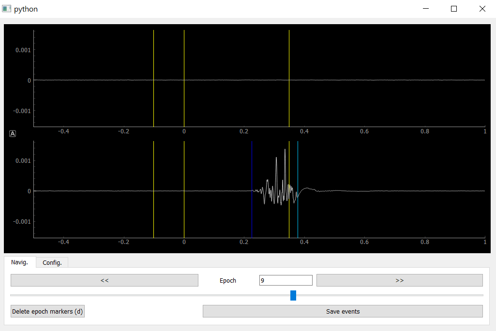

Myonset QuickStart
==================

Myonset is a package to process and detect signal burst(s) onset and offset, developed for electromyographic (EMG) signal.
Myonset implements tools for signal preprocessing, **automatic onset and offset detection**, as well as **visualization and correction** of onset and offset latencies. 
Standard processing pipeline in Myonset is briefly described below.

1. Import EMG data
------------------
Myonset does not provide loading tools, we recommend loading EMG files using `MNE-python <https://mne.tools/stable/index.html>`_ (`see available formats in MNE-python <https://mne.tools/stable/python_reference.html#reading-raw-data>`_). 
Also, text files can be read directly (module `use_txt`, function ``load_txt_file``). For example below, biosemi .bdf file is loaded through mne::

    import mne
    raw = mne.io.read_raw_bdf(file_name, preload=True)

2. Extract events
-----------------
When processing raw EMG signal, it is important to keep track of events occuring during the experiment. Typically, event **markers** (or **triggers**) are recorded together with raw data file. In biosemi files for instance,
event triggers are recorded on the *Status* channel. ::

    trigger_events = mne.find_events(raw, stim_channel='Status')

In Myonset, the specific class ``Events`` is implemented to store and manipulate event triggers. Documentation on ``Events`` structure is available in the :ref:`Events class <guide_events>` section. ::

    import myonset as myo
    sf = raw.info['sfreq']
    events = myo.Events(sample=trigger_events[:,0],
			code=trigger_events[:,2], \
			chan=[-1]*trigger_events.shape[0], sf=sf)

3. Pre-process EMG signals
--------------------------

Pre-processing functions are available in modules `use_mne` or `use_txt` (depending on how data were loaded in step 1). For example below, bipolar montage is 
applied to EMG channels, EMG signal is high-pass filtered and extracted in 2D numpy array::

	myo.use_mne.bipolar_ref(raw, ['EXG1','EXG3'], ['EXG2','EXG4'], new_ch=['EMG_1','EMG_2'], copy=False)
	raw = myo.use_mne.apply_filter(raw, ch_names=['EMG_1','EMG_2'], low_cutoff=10)
	data = myo.use_mne.get_data_array(raw, ch_names=['EMG_1','EMG_2'])

Full example code to perform steps 1-3 is provided in tutorial notebooks `load_and_prepoc_edf` , `load_and_prepoc_brainvision` , `load_and_prepoc_bdf` and `load_and_prepoc_text`. Once done, you can either save the ``data`` signal array and 
``events`` structure for later use (as in the tutorials), or directly continue with the following steps: 

4. Automatic detection of EMG onsets and offsets: 
-------------------------------------------------
First, continuous EMG signal is segmented in trials, or **epochs**, defined between tmin and tmax latencies around reference events (i.e., time 0 events). 
Typically, stimulus marker events are used as time 0 events. ::

    code_t0 = [11,12,21,22]
    epochs_events = events.segment(code_t0=code_t0, tmin=-0.5, tmax=1)
    epoch_time = myo.times(-0.5, 1, events.sf)
    epochs_data = epochs_events.get_data(data)

Then, automatic detection of onsets and offsets is performed for each epoch using the function ``get_onsets``. The function is explained in detail in section :ref:`Utilization of get_onsets function <get_onsets>`, we here describe it very briefly:

1. In first step, time windows containing EMG signal exceeding the specified threshold are detected. This is done on raw signal, if parameter ``use_raw`` is set to True and on Teager-Kaiser transformed signal if ``use_tkeo`` is set to True. The threshold values are defined, respectively, by parameters ``th_raw`` and ``th_tkeo``. ``th_raw`` value is usually between 3 and 7, ``th_tkeo`` between 8 and 12, default values are set to 3.5 and 8, respectively.

2. In second step, onset and offset are determined in each window containing active EMG signal (using the integrated profile method).

For instance, to get EMG onset(s) and offset(s) on epoch 5, first channel::

    current_epoch = 5
    current_channel = 0
    onsets,offsets = myo.get_onsets(epochs_data[current_epoch,current_channel,:], epoch_time, sf=epochs_events.sf,\
                                    th_raw=5, use_raw=True, mbsl_raw=None, stbsl_raw=None,\
                                    th_tkeo=10, use_tkeo=True, mbsl_tkeo=None, stbsl_tkeo=None)

Onsets and offsets are given in time samples relative to the beginning of ``current_epoch``, such that ``epoch_time[onsets]`` returns burst(s) onset(s) time latencies relative to time 0 event. 
Detailed description of ``get_onsets`` parameters is also provided in :ref:`this table<table1>`, and full example code is provided in tutorial notebook `automatic_detection`.  

Onsets and offsets can then be stored in events object and included in ``epochs_events``, for instance using codes 4 and 5 (note that you should use codes not already in use in your dataset)::

    code_onset = 4
    onsets_events = myo.Events(sample=onsets, time=epoch_time[onsets], code=[code_onset]*len(onsets), chan=[current_channel]*len(onsets), sf=epochs_events.sf)
    epochs_events.list_evts_trials[current_epoch].add_events(onsets_events)

    code_offset = 5
    offsets_events = myo.Events(sample=offsets, time=epoch_time[offsets], code=[code_offset]*len(offsets), chan=[current_channel]*len(offsets), sf=epochs_events.sf)
    epochs_events.list_evts_trials[current_epoch].add_events(offsets_events)
	
In the next step, we recommend to transform *epoched* events back into *continuous* events, i.e., with latency information relative to the beginning 
of the EMG file instead of the beginning of each epoch.
In Myonset, this can be easily done using the method ``as_continuous()``
(storing the events as continuous is usually a good idea, as it maintains the time correspondence between the EMG signal and the events)::

    events_with_detection = epochs_events.as_continuous()[0]
 
Note that the new ``events_with_detection`` does not contain original events that were outside the interval used for epoching. For instance here, any event not falling
between 0.5 s before stimulus and 1 s after stimulus has been lost.

To make sure all original events are retained, we recommend to combine original ``events`` and ``events_with_detection``.
All duplicated events will be deleted automatically if parameter ``drop_duplic`` is set to True::

    events_with_detection.add_events(events, drop_duplic=True)

Finally, results of automatic detection must be inspected. Indeed, it is almost impossible to obtain perfectly accurate automatic detection given the signal to noise ratio of EMG. 
Although time-consuming, we hence strongly recommend to proceed to the visualization and correction step described below.
**Note that automatic detection from Myonset is not intended to be used without inspection.**

5. Visualization and correction of automatic onset and offset detection markers
-------------------------------------------------------------------------------

This step of visual inspection is required for two types of corrections. First, check whether any EMG burst of interest has been dismissed,
or whether any background EMG activity has been erroneously marked as EMG of interest (i.e., to correct automatic detection *misses* and *false alarms*). 
Second, adjust onset and offset time positions latencies when automatic detection markers are shifted relative to true, visually-detected, onset and offset.

Myonset contains a customed visualization window, allowing to both visualize **and correct** onset and offset event markers. 
To use the ``viz`` window, one first needs to create a viz application and fill in with 
continuous data and events, and the list of time 0 events::

    import sys
    viz = myo.Viz(sys.argv)
    viz.load_data(data, events_with_detection, code_t0,\
                  code_movable_1=4, code_movable_2=5)

Once done, the viz window is displayed using::

    viz.show()

A complete description is available :ref:`in this section <guide_vizEMG>`, here is a very brief introduction:

* Below signals, use the ``Navig.`` tab to navigate across trials, and the ``Config.`` tab to configurate data views and key shortcuts to jump to next/previous trial (as defined by time 0 events),
* Use left and right mouse clicks in data view windows or data axis to pan and zoom in and out signals,
* Vertical lines show marker events. Original (fixed) events are displayed in yellow, no interaction is possible with those. Dark and light blue lines show events resulting from onset and offset automatic detection. With those, you can:
    * left click on the marker + drag to adjust event time position,
    * right click on the marker to suppress the event,
    * Ctrl key + left click to add an onset (dark blue) event,
    * Ctrl key + right click to add an offset (light blue) event.

Once the onset and offset markers correction is finished, just close the Viz window (for information, the corrected markers are automatically saved in file `viz_events.csv`). 

Corrected markers can be accessed with the command ``viz.get_events()``. Finally, we recommend to save the corrected events with ``to_csv(<new_filename>)``,
to avoid erasing file `viz_events.csv` next time ``viz`` window is used. ::

    corrected_events = viz.get_events()
    corrected_events.to_csv('corrected_events_participantXX.csv')

